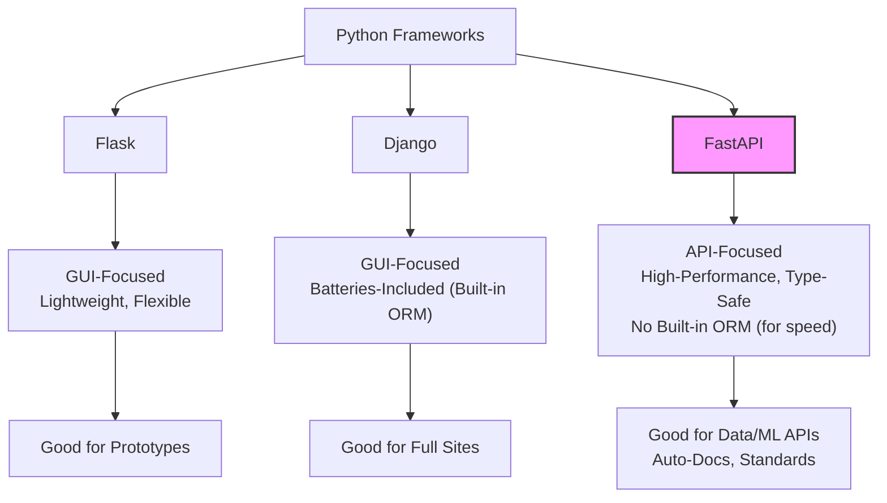
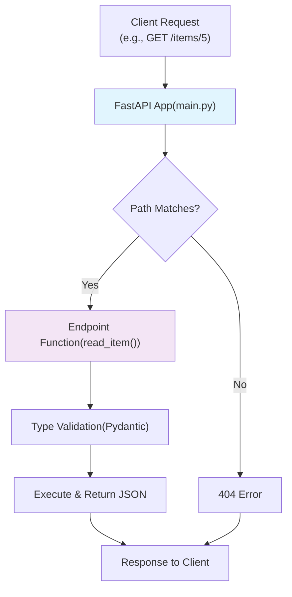
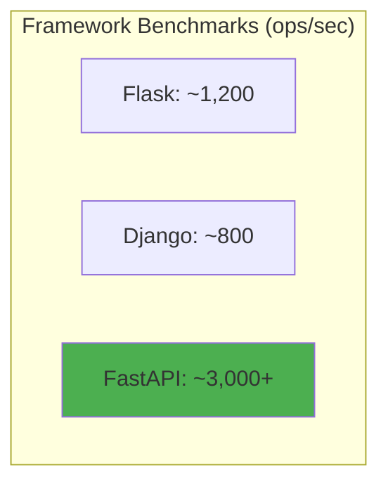

# FastAPI Unleashed: Building High-Performance APIs with Python – A Beginner's Guide

Welcome to this dive into FastAPI, one of the most exciting web frameworks in the Python ecosystem! If you're an experienced Python developer looking to build fast, scalable web applications that handle data and machine learning workloads with ease, you're in the right place. In this post, we'll summarize the essentials from a quick intro course on FastAPI, expand on its core concepts with simple examples, and visualize key ideas using Mermaid diagrams for clarity. Whether you're transitioning from Flask or Django or starting fresh, FastAPI's blend of speed, simplicity, and standards makes it a game-changer for API development.

By the end, you'll have a running example, understand why FastAPI shines for high-throughput apps, and know how to get started. Let's break it down!

## Why FastAPI? A Quick Overview

FastAPI is designed for modern web APIs that need to manage data efficiently—think high-speed transactions for machine learning models or data pipelines. Unlike traditional GUI-focused frameworks, it's built for the API-first world, where uptime and performance are non-negotiable.

Key perks in a nutshell:
- **Speed**: One of the quickest Python frameworks, rivaling Node.js or Go in benchmarks.
- **Simplicity**: Uses Python type hints for "low-code" development—your API code looks like plain functions.
- **Robustness**: Auto-generates interactive docs (Swagger UI) and validates inputs out of the box.
- **Standards**: Fully OpenAPI and JSON Schema compliant, making it easy to integrate with tools.

In simple terms, FastAPI lets you write less boilerplate while getting production-ready code. It's perfect for data-heavy apps, like serving ML predictions or handling real-time analytics, without the overhead of full ORMs.

### FastAPI vs. Other Python Frameworks: A Simple Comparison

Flask and Django are great, but they're geared toward web pages with forms and templates. FastAPI? It's API-native, skipping GUI bloat for pure performance.

Here's a quick Mermaid diagram comparing them:



- **Flask**: Simple, no built-in ORM—great for small APIs but requires more setup for validation.
- **Django**: Heavyweight with ORM for databases, but slower for pure APIs due to overhead.
- **FastAPI**: No ORM (keeps it fast for data ops), but uses Pydantic for validation. Ideal for high-throughput without bloat.

For ML/data apps, FastAPI's lack of ORM avoids slowdowns from database mapping, letting you focus on quick HTTP exchanges.

## Building Your First FastAPI App: Step-by-Step with Code

Getting started is a breeze—FastAPI is "simple to spin up." Let's replicate the transcript's hello-world example, with comments for clarity.

### Step 1: Install FastAPI
Open your terminal and run:
```bash
pip install fastapi uvicorn
```
- `fastapi`: The framework.
- `uvicorn`: ASGI server to run it (like `python -m uvicorn`).

### Step 2: Create `main.py`
This is your app file. We'll define a basic API with a simple endpoint.

```python
from fastapi import FastAPI  # Import the core FastAPI class

# Create an instance of FastAPI app
app = FastAPI(title="My First API", description="A simple FastAPI example", version="1.0.0")

# Define a simple GET endpoint at root path
@app.get("/")  # Decorator for GET requests to "/"
def read_root():  # Simple function that returns a dict (auto-converted to JSON)
    return {"message": "Hello World! FastAPI is running."}

# Another endpoint for a specific path
@app.get("/items/{item_id}")  # Path parameter: item_id is required
def read_item(item_id: int, q: str = None):  # Type hints for validation; q is optional query param
    return {"item_id": item_id, "q": q}  # Returns JSON response

# Run with: uvicorn main:app --reload (or fastapi dev main.py)
```

- **Simple Explanation**: `@app.get("/")` creates a web page at your app's root that says "Hello World." The `/items/{item_id}` endpoint takes an ID (e.g., `/items/5?q=test`) and returns it as JSON. Type hints (like `int`) auto-validate inputs—no extra code!

### Step 3: Run the App
From your terminal:
```bash
uvicorn main:app --reload  # --reload for dev mode; auto-restarts on changes
```
Or, as in the transcript:
```bash
fastapi dev main.py
```

Once running (usually at http://127.0.0.1:8000), visit:
- Root: http://127.0.0.1:8000 → {"message": "Hello World! FastAPI is running."}
- Items: http://127.0.0.1:8000/items/5?q=test → {"item_id": 5, "q": "test"}

Auto-docs appear at http://127.0.0.1:8000/docs—test endpoints interactively!

### A Simple Workflow Diagram

Here's a Mermaid diagram showing the FastAPI request flow:



This visualizes how FastAPI routes requests, validates, and responds—simple yet powerful.

## FastAPI in Action: A Data/ML Example

To show its power for data/ML, let's extend the app with a simple "predict" endpoint simulating an ML model (using a dummy function).

Add to `main.py`:
```python
from pydantic import BaseModel  # For request/response models
from typing import Optional  # For optional types

# Simple data model for input
class PredictionInput(BaseModel):
    feature1: float  # e.g., user age
    feature2: str    # e.g., user type

# Dummy ML function (replace with real model like scikit-learn)
def simple_ml_predict(f1: float, f2: str) -> float:
    # Simple logic: Predict based on feature1 + length of feature2
    return f1 * 2 + len(f2)

# Endpoint for ML prediction
@app.post("/predict")  # POST for body data
def predict(input_data: PredictionInput) -> dict:  # Auto-parses JSON to model
    prediction = simple_ml_predict(input_data.feature1, input_data.feature2)
    return {"prediction": prediction, "input": input_data.dict()}

# Run as before
```

Test with curl:
```bash
curl -X POST "http://127.0.0.1:8000/predict" -H "Content-Type: application/json" -d '{"feature1": 25, "feature2": "premium"}'
```
Output: {"prediction": 52.0, "input": {"feature1": 25, "feature2": "premium"}}

Why simple? FastAPI's type hints validate the JSON input—no manual checks. For real ML, swap `simple_ml_predict` with a loaded model (e.g., from joblib).

### Performance Comparison Diagram

FastAPI's speed comes from Starlette/ASGI. Here's a simple Mermaid bar chart (using graph for approx):



(FastAPI often tops TechEmpower benchmarks—check them for latest numbers.)

## Tips for FastAPI Development

From the transcript:
- **Run from Terminal**: Use `fastapi dev main.py` or `uvicorn main:app --reload`. Look for "Application startup complete" in logs.
- **Stop Server**: Ctrl+C in the terminal.
- **Practice Locally**: Install in your env for real-world feel—avoid "Run" buttons in IDEs.

Common pitfall: Forgetting `--reload` means no auto-restarts on code changes.

## Wrapping Up: Why Choose FastAPI?

FastAPI combines Python's ease with web-scale speed—perfect for APIs that "just work" with data/ML. It's low-code, standards-compliant, and fun to build with. Start with the example above, explore docs at [fastapi.tiangolo.com](https://fastapi.tiangolo.com/), and scale from there.
