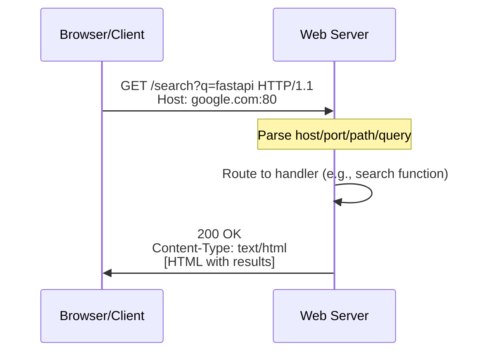
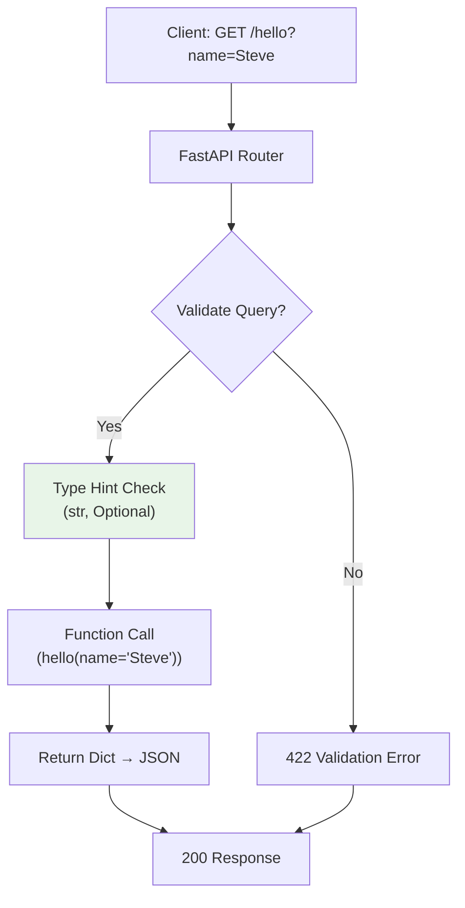

# FastAPI GET Requests: Fetching Data the Simple Way – A Hands-On Guide

Hey, API builders! Ever hit a web page and wondered, "How does that search bar pull results so fast?" It's all thanks to GET requests—the workhorse of the web. If you're dipping into FastAPI (or leveling up from Flask/Django), this post breaks down GET ops in simple terms, with code you can copy-paste, cURL tests, and even a Mermaid diagram to visualize the flow. Based on a quick course intro, we'll cover HTTP basics, your first FastAPI GET endpoint, query params, and tips to avoid pitfalls.

By the end, you'll have a running app that handles fetches like a pro. Let's turn theory into code—grab your terminal and let's go!

## GET Requests: The Basics of Fetching Over the Web

GET is the "hey, send me info" request—safe, idempotent, and perfect for searches or reads. No data changes; just retrieve.

Break down a classic: Typing "fastapi" into Google (google.com/search?q=fastapi).

- **Host**: google.com (the server/load balancer).
- **Port**: 80 (default for HTTP; 443 for HTTPS).
- **Path**: /search (tells the server which handler to use).
- **Query String**: ?q=fastapi (params like key "q" with value "fastapi").

Over HTTP, it's a simple request → response loop. Here's a Mermaid diagram of the flow:



Simple, right? No body needed—params go in the URL. FastAPI makes this a breeze with decorators.

[FastAPI Docs on Paths](https://fastapi.tiangolo.com/tutorial/first-steps/) – Start here for more.

## Your First FastAPI GET Endpoint: Hello World

FastAPI shines for APIs: Import, instantiate, decorate—done. No boilerplate hell.

### Step 1: Setup
```bash
pip install fastapi uvicorn  # uvicorn runs the server
```

### Step 2: Create `main.py`
```python
from fastapi import FastAPI  # Core import for app creation

app = FastAPI()  # Create app instance

@app.get("/")  # Decorator: Handle GET at root path ("/")
def root():  # Simple function – FastAPI auto-converts to JSON
    return {"message": "Hello World!"}  # Dict becomes JSON response
```

- **What Happens?** `@app.get("/")` wires the function to GET /. Hit it, get JSON.

### Step 3: Run & Test
```bash
uvicorn main:app --reload  # --reload auto-restarts on changes
```
Server runs at http://127.0.0.1:8000. Visit `/` → {"message": "Hello World!"}.

cURL test (simple client):
```bash
curl http://127.0.0.1:8000/ -v  # -v for verbose headers
```
Output: HTTP/1.1 200 OK + JSON.

Auto-docs? http://127.0.0.1:8000/docs – Swagger UI to test!

## Adding Query Params: Make It Dynamic

Query params (e.g., ?name=Steve) add flexibility. FastAPI validates with type hints—simple as function args.

Update `main.py`:
```python
from typing import Optional  # For optional params

@app.get("/hello")  # New endpoint: /hello?name=Steve
def hello(name: Optional[str] = "World"):  # Optional str, default "World"
    return {"message": f"Hello, {name}!"}  # Simple string interpolation
```

- **How It Works**: `name: Optional[str] = "World"` auto-parses ?name=Steve, validates type, defaults if missing.

Test:
- `/hello` → {"message": "Hello, World!"}
- `/hello?name=Steve` → {"message": "Hello, Steve!"}

cURL:
```bash
curl "http://127.0.0.1:8000/hello?name=Steve" -H "Accept: application/json"
```

**Query Flow Diagram**:



Validation is built-in—no extra code for 422 errors on bad types!

## Common Gotchas & Pro Tips

- **No Browser for Testing?** cURL is king: `-v` for headers, `-H` for custom (e.g., JSON accept).
- **Uptime Check**: Logs say "Application startup complete"? Good. Ctrl+C to stop.
- **Dev Mode**: `--reload` watches files—edit, save, magic.
- **Why No ORM?** FastAPI skips for speed; add SQLAlchemy later for DBs.

For ML? Pair with Pydantic for input models—validate features before feeding your model.

## Wrap-Up: GET Started with FastAPI

GET requests are the gateway to APIs, and FastAPI makes them feel like writing functions. From plain "/" to param-powered "/hello", it's fast, validated, and documented. Build the example, tweak it, and scale to data/ML endpoints.

Fork this on GitHub, experiment, and share your twists! Next up: POST for updates. Questions? Hit comments—let's build.

### Further Reading


[FastAPI Tutorial](https://fastapi.tiangolo.com/tutorial/first-steps/) | [cURL Man](https://curl.se/docs/manpage.html)